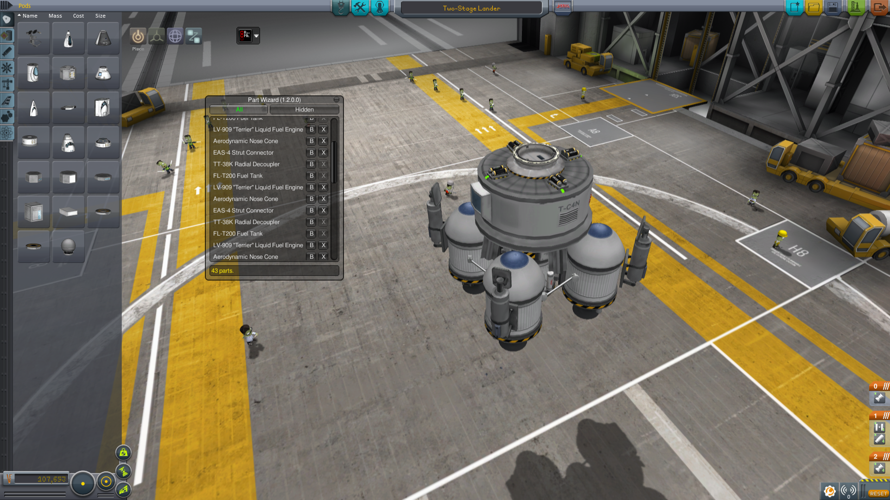
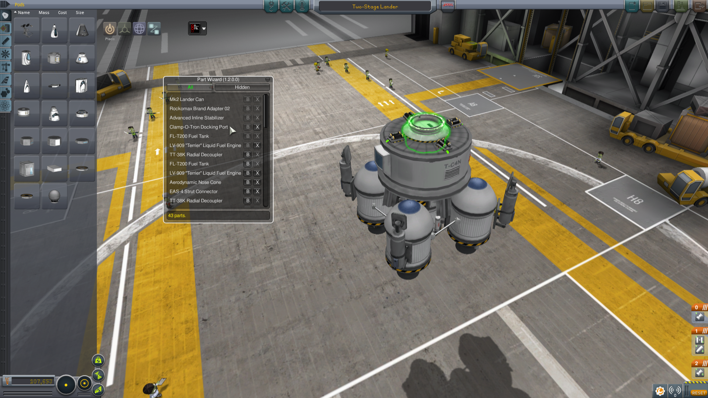
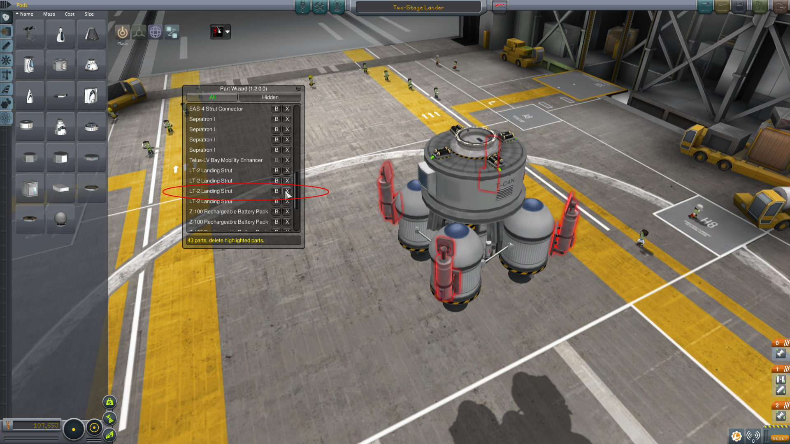
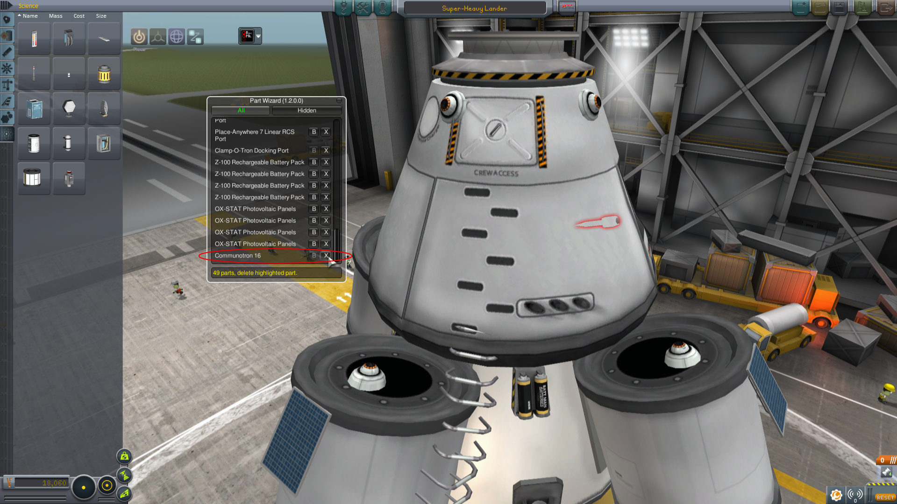
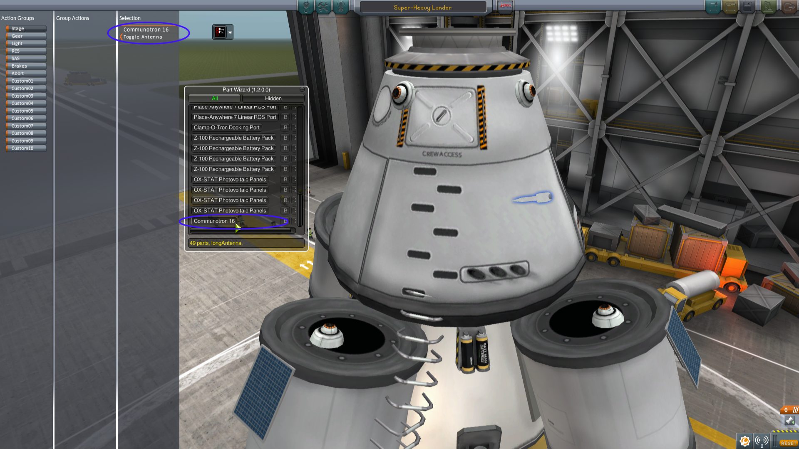
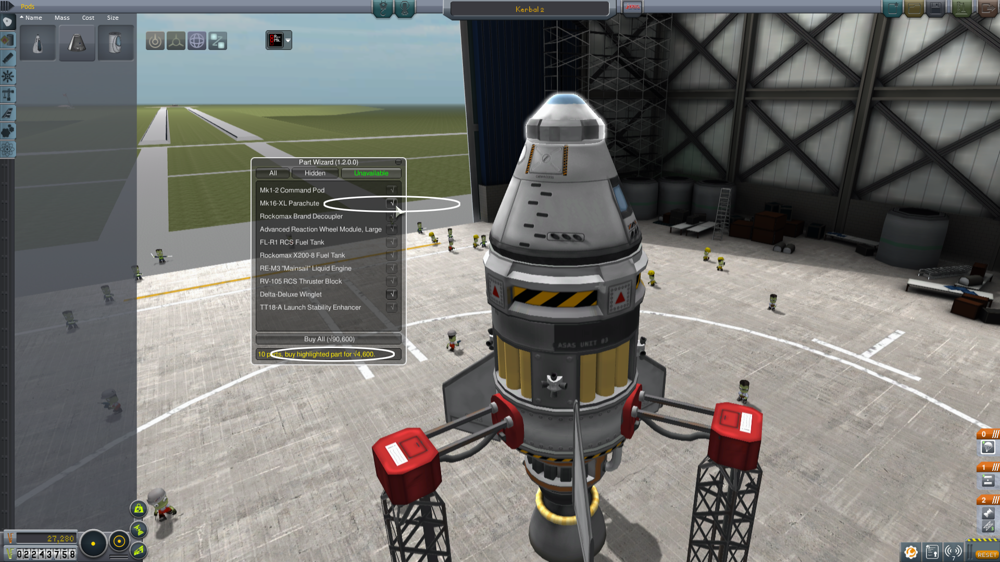
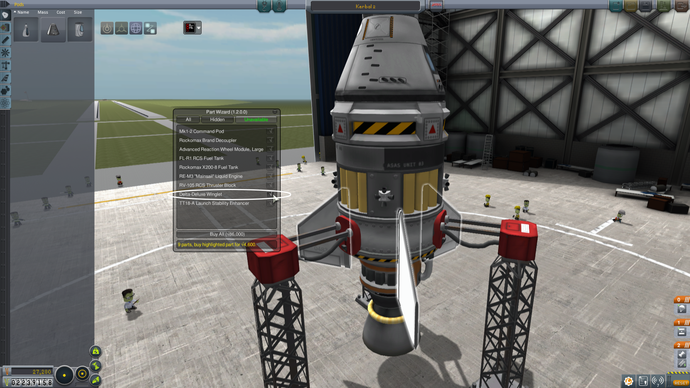
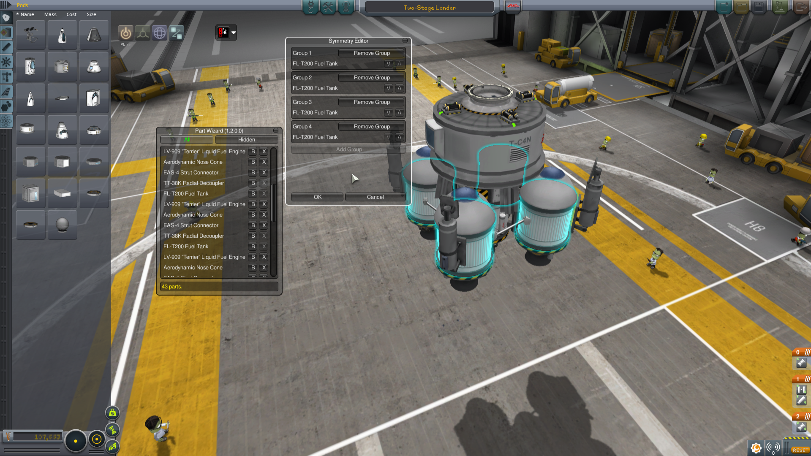
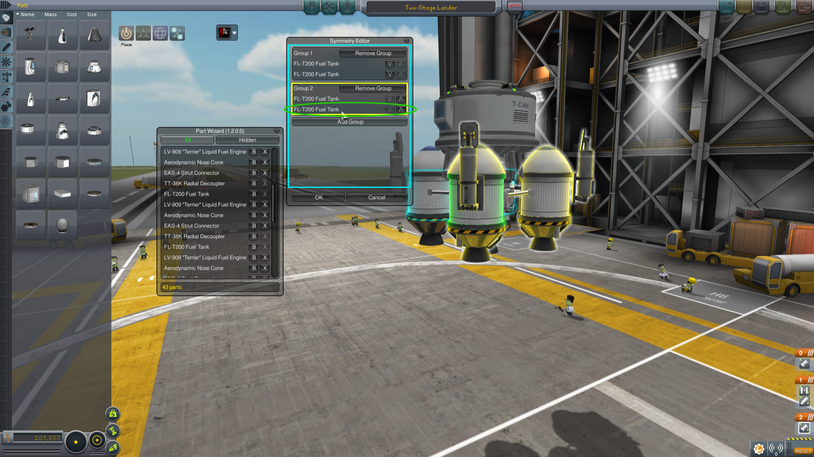
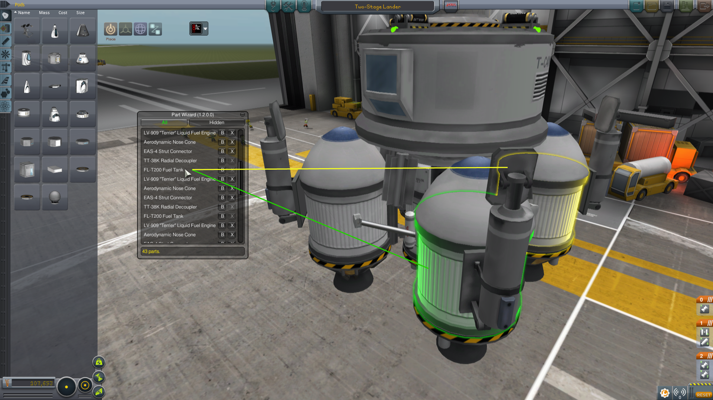

# Part Wizard /L Unleashed

Part Wizard is a vehicle design utility plugin that adds a few conveniences when building your next strut/booster carrier.

[Unleashed](https://ksp.lisias.net/add-ons-unleashed/) fork by Lisias.

## Showdown

### Slide 1

Part Wizard shows the list of your vessel's parts, total number of parts and provides some convenient tools...

### Slide 2

Throughout Part Wizard, various colors are used to provide information about Part Wizard's actions, symmetry and child part relationships. Pictured is a simple mouseover of a part on the list and the corresponding part highlighted in green.

### Slide 3

Mouse over the 'X' (delete) button and the parts that will be deleted are highlighted in Delete Me Red. Pictured is a part with symmetry and deleting a symmetrical part will also delete its counterparts.

### Slide 4

The highlighting capability introduced in KSP 0.90 is used throughout Part Wizard, like in this prime (albeit contrived) example where a part has become "stuck" within another part. Part Wizard can quickly fix these situations with the delete tool, or...

### Slide 5

...switch to the Action Group Editor and Part Wizard 1.2.0 now allows selecting of any part via the part list. (Thanks to Vlos for the idea, sorry it took almost a year to make it to a release!)

### Slide 6

Part Wizard 1.2.0 adds a new feature to the career modes that allow quick bulk part purchases for your imported designs. Shown in the Unavailable list are all of the parts not currently available to you, and the parts that can be bought have a handy "buy" button.

### Slide 7

In Unavailable mode, Part Wizard highlights each part in white regardless of symmetric or family relationship, so you can see how far your entry cost funds will go. Additionally, there's a "buy all" button for quickly bringing new designs in to production - if your space program is ready.

### Slide 8

The Symmetry Editor allows for detailed customizing of how parts are organized. Shown in cyan are all of the parts the Symmetry Editor is currently working with.

### Slide 9

Updated for Part Wizard 1.2.0 is the symmetry group highlighting. All parts of the current symmetry operation remain cyan, the current group and its children are yellow, and the specific part in green.

### Slide 10

The symmetry of the four fuel tanks has been edited in to two groups of two.
NEWEST IN MOST VIRAL

